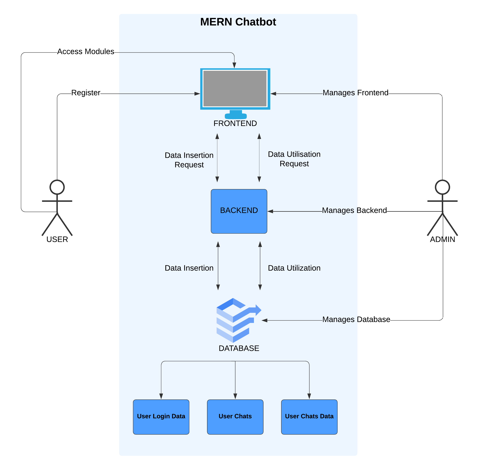
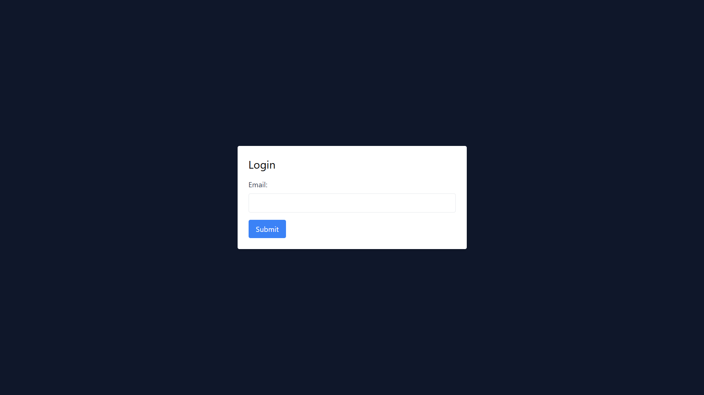
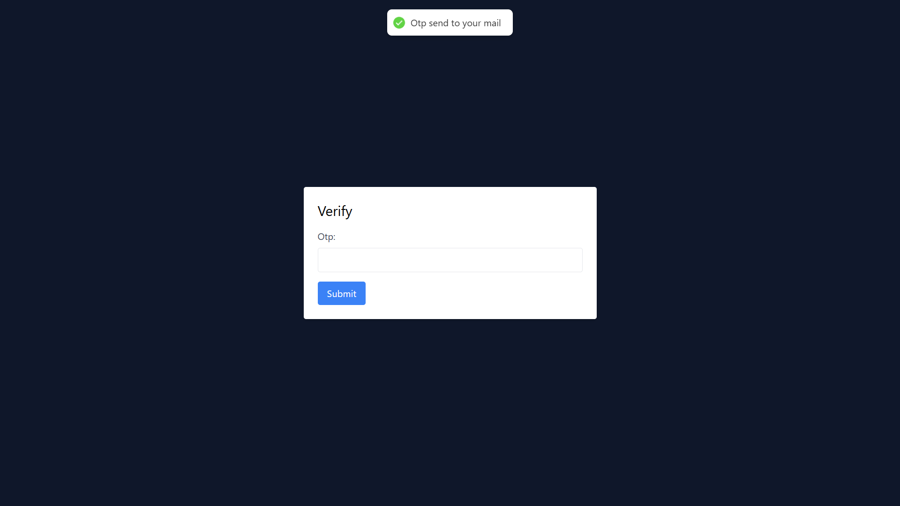
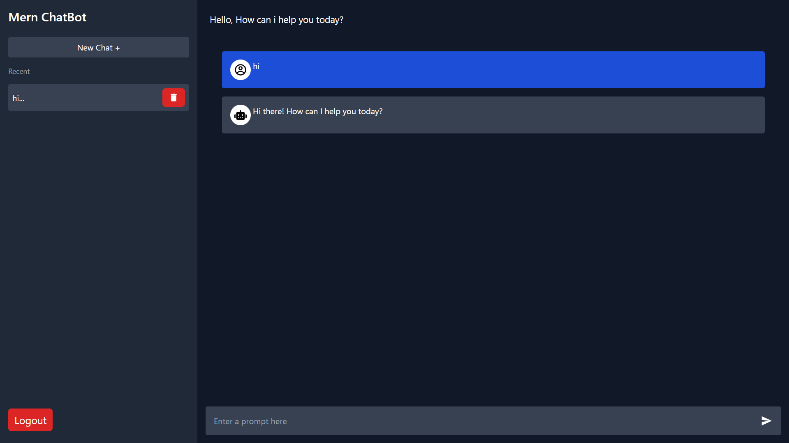
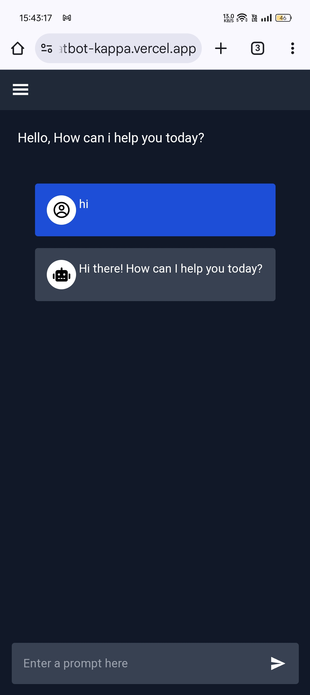
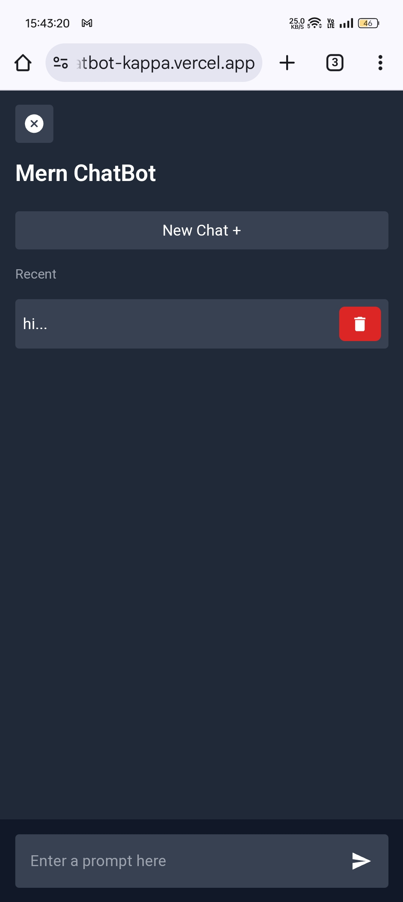

# 🤖 MERN Chatbot

**MERN Chatbot** is a conversational web application built using the MERN stack (MongoDB, Express, React, and Node.js). This AI-powered chatbot enables real-time user interaction and is designed to streamline customer service by addressing frequent queries. With integration of Gemini AI, the chatbot understands natural language, providing efficient and relevant responses.

## 📚 Table of Contents

1. [Features](#features)
2. [System Architecture](#system-architecture)
3. [Tech Stack](#tech-stack)
4. [Project Structure](#project-structure)
5. [Installation](#installation)
6. [Screenshots](#screenshots)
7. [Usage](#usage)
8. [Contributing](#contributing)
9. [Authors](#authors)

## Features

- 🔒 **Secure Authentication**: Login with OTP verification using Nodemailer.
- 💬 **Real-time Chat**: Users can engage in real-time conversations with the chatbot in a user-friendly, single-page application.
- 💾 **Persistent Data Storage**: MongoDB manages and stores user chat history for retrieval and analysis.
- 📈 **Scalable Design**: Capable of handling a high volume of users with optimal performance.
- 🤖 **Gemini AI Integration**: Provides intelligent, contextual responses to user inputs.
- 📱 **Responsive Layout**: Optimized for both desktop and mobile devices.

## System Architecture

The architecture follows a client-server model to handle user interactions efficiently:



## Tech Stack

- **Frontend**: HTML, Tailwind CSS, React, Vite
- **Backend**: Node.js, Express, Nodemailer, Axios
- **Database**: MongoDB (Atlas for cloud storage)
- **AI/ML Integration**: Gemini AI for enhanced NLP capabilities

## Project Structure

```plaintext
MERN_Chatbot/
├── chat-frontend/              # Frontend folder
│   ├── public/                 # Public assets and HTML template
│   ├── src/                    # React application source code
│   │   ├── components/         # Reusable components (e.g., Header, Sidebar)
│   │   ├── contexts/           # Contexts for managing user and chat data
│   │   ├── pages/              # Pages for login, verification, and main chat
│   │   ├── App.jsx             # Main application component with routing
│   │   └── main.jsx            # Entry point with backend URL configuration
│   ├── package.json            # Frontend dependencies
├── chatserver/                 # Backend folder
│   ├── controllers/            # Contains logic for handling user and chat actions
│   ├── models/                 # MongoDB schemas for User, Chat, and Conversation
│   ├── routes/                 # Express routes for chat and user operations
│   ├── middlewares/            # Authentication middleware
│   ├── config/                 # Database connection and environment setup
│   ├── utils/                  # Helper functions (e.g., OTP email service)
│   ├── .env                    # Environment variables for backend (create this file)
│   └── package.json            # Backend dependencies
└── README.md                   # Project documentation
```

## Installation

This project is deployed so can't be run on localhost. If you want to run it on localhost, change branch to LocalHost and follow belows steps.

### Backend Setup

1. **Navigate to the Backend Directory**:

   ```bash
   cd MERN_Chatbot_Backend
   ```

2. **Install Dependencies**:

   ```bash
   npm install
   ```

3. **Set Up Environment Variables**:

   - Create a `.env` file in the backend directory.
   - Add MongoDB URI, email server details for OTP, and JWT secrets:
     ```plaintext
     PORT=5001
     Db_url=DB_URL
     Gmail=email@gmail.com
     Password=vwwz aehp xxxx  xxxx
     Activation_sec=yutey
     Jwt_sec=ertert
     ```

4. **Run the Backend Server**:
   ```bash
   npm run dev
   ```

### Frontend Setup

1. **Navigate to the Frontend Directory**:

   ```bash
   cd MERN_Chatbot_Frontend
   ```

2. **Install Dependencies**:

   ```bash
   npm install
   ```

3. **Set Backend Server URL**:
   - In `src/main.jsx`, set the `server` constant to point to your backend server:
     ```javascript
     const server = "http://localhost:5000";
     ```
4. **Set Gemini URL**:

   - In `src/context/ChatContext.jsx`, set the `Gemini_API` constant to your Gemini API:
     ```javascript
     const Gemini_API = "api";
     ```

5. **Run the Frontend Application**:
   ```bash
   npm run dev
   ```

## Screenshots

### Desktop





### Mobile

<p align="center">
  
  
</p>

## Usage

1. Open the provided vercel or frontend localhost link if on LocalHost branch in your browser.
2. Enter your email to receive an OTP, then verify to log in.
3. Begin chatting with the bot on the main chat interface after logging in.
4. View previous chat history or start a new conversation as needed.
5. Log out when finished to securely end your session.

## Contributing

We welcome contributions to improve MERN Chatbot! Follow these steps to get started:

1. Fork the repository.
2. Create a new branch for your feature:
   ```bash
   git checkout -b feature/YourFeature
   ```
3. Make your changes and commit them:
   ```bash
   git commit -m 'Add a new feature'
   ```
4. Push to your branch:
   ```bash
   git push origin feature/YourFeature
   ```
5. Open a pull request.

http://localhost:5173/
